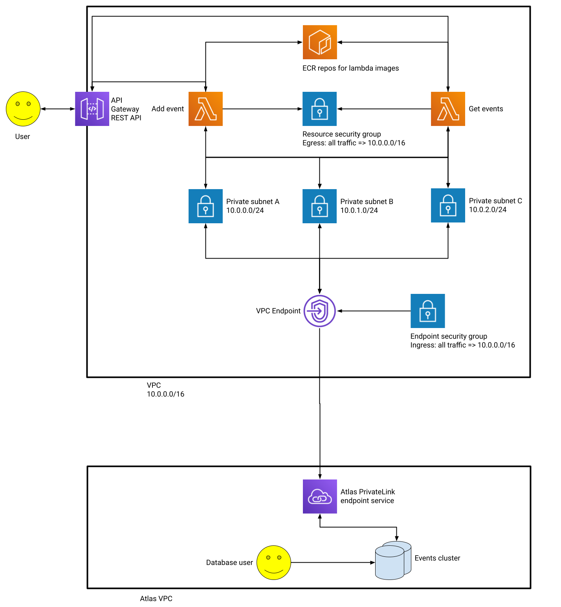

# IoT Events API

A REST API for storing and retrieving IoT device events, built with Terraform, AWS Lambda, and MongoDB Atlas.

## Running Locally

Ensure [Docker](https://docs.docker.com/get-docker/) and [Docker Compose](https://docs.docker.com/compose/install/) are present on your system. You can then run `docker-compose up`. **Note that** you'll need to rebuild with `docker-compose build` when making changes to the function code.

### Example Requests

#### Adding a New Event

```sh
$ curl -XPOST "http://localhost:9001/2015-03-31/functions/function/invocations" -d '{ "body": "{ \"date\": \"'$(date --iso-8601=seconds --utc)'\", \"deviceID\": \"8f188304-e7b3-4a16-a243-b9470468478a\", \"eventType\": \"temp_celcius\", \"value\": 4 }" }'
```

#### Retrieving events for a given device ID by event type and date

```sh
$ curl -XPOST "http://localhost:9000/2015-03-31/functions/function/invocations" -d '{ "queryStringParameters": { "deviceID": "8f188304-e7b3-4a16-a243-b9470468478a", "date": "'$(date --iso-8601=date --utc)'", "eventType": "temp_celcius" } }'
```

## Deploying to AWS and MongoDB Atlas

The infrastructure of this project is managed with [Terraform](https://www.terraform.io/); make sure you have this installed before proceeding.

Firstly, you'll need to ensure that you have [valid AWS credentials configured on your machine](https://registry.terraform.io/providers/hashicorp/aws/latest/docs#authentication); I recommend using [`aws configure`](https://docs.aws.amazon.com/cli/latest/reference/configure/) to write your key ID and secret key value to the AWS CLI's shared credentials file.

Next, [create an Atlas API key](https://docs.atlas.mongodb.com/configure-api-access/#programmatic-api-keys) with the _Organization Project Creator_ scope, which must be present on your system as environment variables:

```sh
$ export MONGODB_ATLAS_PUBLIC_KEY=<Atlas public key> MONGODB_ATLAS_PRIVATE_KEY=<Atlas private key>
```

There are a handful of root module variables to which values must be assigned; this can be achieved by renaming `terraform.tfvars.example` to `terraform.tfvars` (i.e. `mv terraform.tfvars.example terraform.tfvars`) and populating it accordingly:

| Variable name  | Description                                                                                                                                                |
| -------------- | ---------------------------------------------------------------------------------------------------------------------------------------------------------- |
| `region`       | The AWS region to which the lambdas and AWS-backed Atlas cluster are deployed e.g. `eu-west-1`                                                             |
| `atlas_org_id` | The ID of the organisation under which the Atlas project will be created                                                                                   |
| `rest_api_key` | The key that consumers need to provide when calling our REST API i.e. this value must be present in the `x-api-key` HTTP header when requesting a resource |

The final prerequisite is to authenticate Docker against AWS ECR, to which our Lambda container images will be pushed:

```sh
$ aws ecr get-login-password --region <AWS region> | docker login --username AWS --password-stdin <AWS account ID>.dkr.ecr.<AWS region>.amazonaws.com
```

You can now deploy the service with `terraform apply`. Upon successful deployment, the full API URL will be displayed as an output. **Note that** it can take ~7-10 minutes to create the Atlas cluster.

### Example Requests

#### Adding a New Event

```sh
$ curl -XPOST "<API URL in Terraform outputs>" -H "Content-Type: application/json" -H "x-api-key: <value provided to rest_api_key Terraform variable>" -d '{"date":"'$(date --iso-8601=seconds --utc)'","deviceID":"8f188304-e7b3-4a16-a243-b9470468478a","eventType":"temp_celcius","value":3}'
```

#### Retrieving events for a given device ID by event type and date

```sh
$ curl -XGET "<API URL in Terraform outputs>?deviceID=8f188304-e7b3-4a16-a243-b9470468478a&eventType=temp_celcius&date=$(date --iso-8601=date --utc)" -H "Content-Type: application/json" -H "x-api-key: <value provided to rest_api_key Terraform variable>"
```

## Architecture



## Data Schema

The schema of our MongoDB events collection follows the [bucket pattern](https://www.mongodb.com/blog/post/building-with-patterns-the-bucket-pattern); by placing individual events within an array field held by a document representing a particular device ID, date range, and event type combination, we can drastically reduce the number of documents the database engine has to scan on retrieval and shrink any indexes against the collection.

```ts
{
  _id: ObjectId;
  date: Date; // the date for the given day e.g. 2021-05-05T00:00:00.000+0000
  deviceID: string;
  eventType: string;
  events: {
    date: Date; // specific event date e.g. 2021-05-05T17:19:35.000+0000
    value: any;
  }
  [];
}
```

## Next Steps

- The Docker images for the Lambda functions are only pushed to ECR when the infrastructure is first provisioned, given the use of the `local-exec` provisioner within the `aws_ecr_repository.lambda_repo` resource. Perhaps it's possible to push the containers when they're updated with the [`kreuzwerker/docker` provider](https://registry.terraform.io/providers/kreuzwerker/docker/latest) and version-tagged images, although we'd still have to manage the latter concern outside of Terraform

- Given our data schema is built upon bucketing, we should create a unique index for the events collection against the date, device ID, and event type fields, to ensure that duplicate buckets can't be created. Unfortunately, [the `mongodbatlas` provider doesn't include a resource for creating indexes](https://github.com/mongodb/terraform-provider-mongodbatlas/issues/308), so we'd have to call the Atlas API directly
